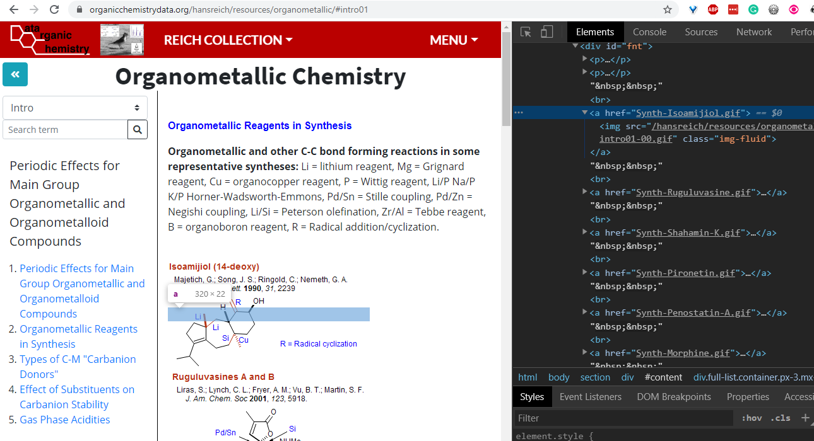

# Editing Broken Links in 'Organometallic Chemistry' section

(This document is being update constantly so please check back regularly. Please feel free to edit the document if you find any errors.)

**Purpose**:
To edit content of 'Organometallic Chemistry' section, specifically:

- Fix broken links in each page

**Prerequisite**:

- Please read the [CONTRIBUTING Guide](../CONTRIBUTING.md) before hand on an overview of how to edit content of this repo.

<br>

## Overviews

- [Editing Broken Links in 'Organometallic Chemistry' section](#editing-broken-links-in-organometallic-chemistry-section)
  - [Overviews](#overviews)
  - [Steps to Edit File Content directly on Github](#steps-to-edit-file-content-directly-on-github)
  - [How to find what Files and What Content to Change](#how-to-find-what-files-and-what-content-to-change)
    - [Data Structure for **Organometallic Chemistry** section](#data-structure-for-organometallic-chemistry-section)
    - [Steps to Identify Broken Links](#steps-to-identify-broken-links)


<br>

## Steps to Edit File Content directly on Github

This is for small content changes (e.g. text, data). If you need to edit the site more extensively (format, create more content, please see the [following section](../CONTRIBUTING.md#steps-to-edit-from-your-own-machine))

1. If you don't have a github account, please register for an account here: https://github.com/
2. Please share your github username with KV and ask him to add you to "Collaborators" list
3. Find the file(s) that need to be edited. Please see the [following section for info on what file and what content to change](#what-files-and-what-content-to-change).
4. Click on the `Edit` button (Pencil image) to edit the content of a specific file. You can click on the "Preview Changes" to see your changes.
5. When done with the editing, go down to "Commit changes" section. Add:
   - In the first text box, and a 1 line summary of what you change (e.g. "Fix spelling issue"). This is required!
   - In the second text box, you can add additional info about the change you make. This box is optional. However, if you change is more than trivial, it is encourage to add the reason for your changes (focus on WHY aspect and not  HOW)
   - Consider [Git Commit Best practice](https://github.com/trein/dev-best-practices/wiki/Git-Commit-Best-Practices) for recommended practice!
6. Choose `Commit directly to the master branch` FOR NOW (subject to change)
7. Click on `Commit changes` button

<br>

## How to find what Files and What Content to Change

### Data Structure for **Organometallic Chemistry** section

- [**/src/hansreich/resources/organometallic**](../src/hansreich/resources/organometallic) : root folder of **Organometallic Chemistry** section
  - [**/src/hansreich/resources/organometallic/organometallic_index**](../src/hansreich/resources/organometallic/organometallic_index): contain index pages that are displayed on the side menu
  - [**/src/hansreich/resources/organometallic/organometallic_data**](../src/hansreich/resources/organometallic/organometallic_data): pages that contain the content for each link in the index pages
    - As of 2020-07-16: there are some broken links in pages inside **./organometallic_data**

### Steps to Identify Broken Links

1. Go to the [**Organometallic Chemistry** page](https://organicchemistrydata.org/hansreich/resources/organometallic/). Each index page in the dropdown select option in the side menu should have the same, if not newer, content as its original page under [**Course Handouts** here](https://www2.chem.wisc.edu/areas/reich/chem842/Index.htm). The following pages would likely to have newer content:
   - Boron
   - Silicon
   - Tin
   - Zinc
2. Choose each index page in the dropdown section
3. For each index page, click on each link on the side menu
4. Compare each link's content with its original page in the link above
5. Some of the pictures in the content is linked to a specific page in the [Total Syntheses section](https://organicchemistrydata.org/hansreich/resources/syntheses/). Some of these links might be broken. Chrome developer tool is suggested to check the html code for each link/image.
6. After finding the broken link, find the closet match in the [Total Syntheses section](https://organicchemistrydata.org/hansreich/resources/syntheses/) and get the correct link.
   - Example:
     - The screenshot below displays [*Organometallic Reagents in Synthesis*](https://organicchemistrydata.org/hansreich/resources/syntheses/#isoamijiol-majetich) in the **Intro** section. The first picture of **Isoamijiol** has the link 
       ```html
       <a href="Synth-Isoamijiol.gif">
       ```
       
       This is a broken link

       
     - You can find the total synthesis of [**isoamijiol** here](https://organicchemistrydata.org/hansreich/resources/syntheses/#isoamijiol-majetich)
7. Find the file with the content that need to be edited
   - Continuing the example above: the file you would need to change is [intro01](../src/hansreich/resources/organometallic/organometallic_data/intro01.html). Hint: to find the file, look at the `#xyz` in the URL, and find the correct file inside [**organometallic_data** folder](../src/hansreich/resources/organometallic/organometallic_data)
8. Correct the wrong link by replacing the content inside `href="xyx"` with the correct **RELATIVE** link
   - Continuing from the example file above: the `href` content should be changed to:
     ```html
     <a href="../syntheses_data/#isoamijiol-majetich">
     ```
     
   - **Note**: it is important to add `../syntheses_data/` in front of the correct `#isoamijiol-majetich` for the link to work correctly

Repeat steps 2-8 as necessary!

When you are done fixing broken link for an index page, you can check it off in [this Trello card](https://trello.com/c/WLM16xkS)
